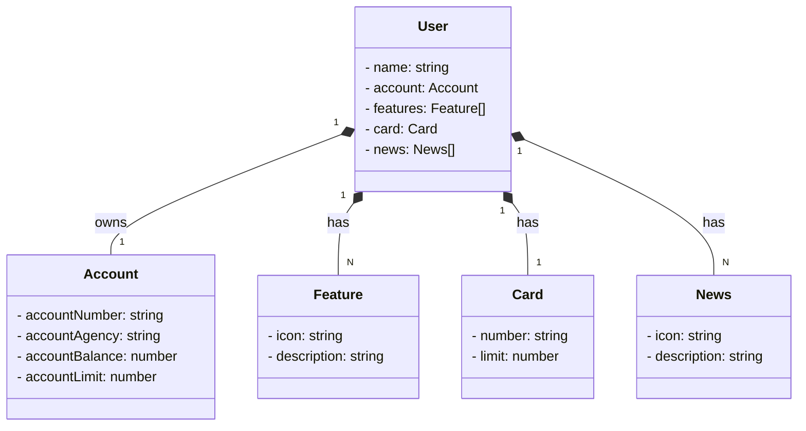

Coisas que eu fiz no *DESAFIO* _Publicando sua API RESTful na Nuvem Usando Spring Boot 3, Java 17 e Railway

#Prática : Criação e IMportação do Projeto
Alterei a descrição no spring initializr

#Versionamento no GitHub
O versionamento ja fiz no proprio git usando os comandos aprendido no curso.

#Abstração Inicial do Domínio no Figma
05:50 - alterei os dados das variaveis no json editor online

#Diagrama de Classes com ChatGPT e Mermaid
## Diagrama de Classes que eu gerei com a IA

###Mapeamento Objeto Relacional (ORM)
Na classe account inserido comentarios das atributos e encapsulamento deles. já esta mapeada em 9:39
Na classe user inserido comentario de tudo que foi feito criação do atributos, feito encapsulamento, anotações e suas explicações
Na classe card também foi feito as mesma anotações, atributos, encapsulamento e comentarios